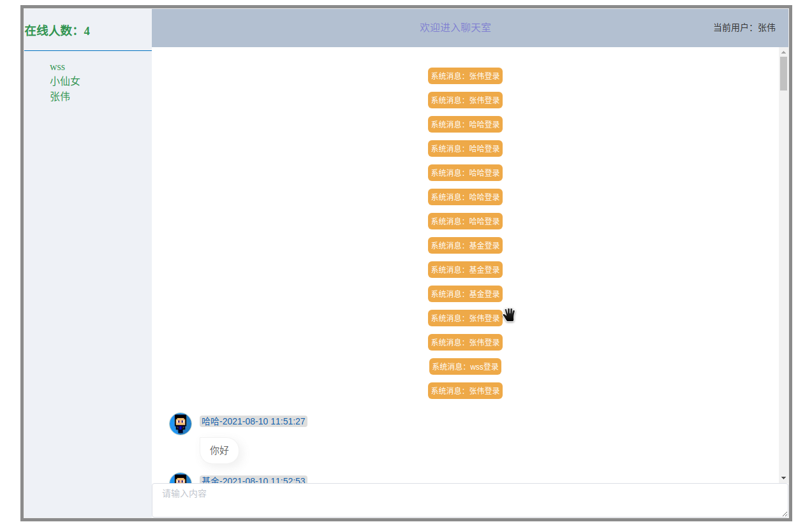

# chatRoom
一个简单使用方便部署的聊天系统

## 前提条件
1. 安装git
2. 安装docker
3. 安装docker-compose

## 部署
只需要执行start.sh脚本即可
```shell
git clone https://github.com/jtyoui/chatRoomFront.git
cd chatRoomFront
./start.sh
```

## 聊天界面


## 界面
[点击跳转到界面地址](https://github.com/jtyoui/chatRoomFront)

## 功能
- [x] 支持群聊
- [x] 支持私聊
- [ ] 支持emoji表情
- [ ] 支持文件传输
