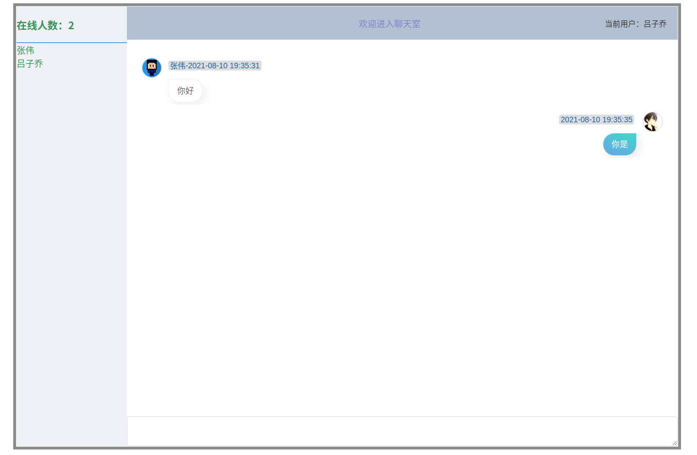

# chatRoom

一个简单使用方便部署的聊天系统

## 注意
```text
如果要部署到其它IP地址上，需要修改一处

web/src/
├── views
│   ├── Home.vue  // 此处需要修改，修改的代码  const ws = new WebSocket('ws://localhost:11280/ws')
│   └── Login.vue


需要将里面的localhost换成对应的ip地址即可
然后编译一下： npm run build
```

## 编译二进制

```shell
go build
```

## 聊天界面



## 界面代码

    查看web文件夹

## 功能

- [x] 支持群聊
- [x] 支持私聊
- [ ] 支持emoji表情
- [ ] 支持文件传输
